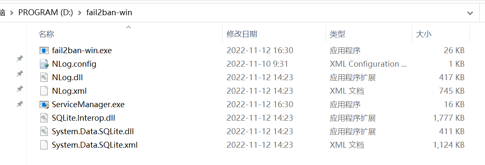

# 1.背景

`Linux`下面使用`fail2ban`防止服务器被暴力破解很方便，`Windows`下未找到合适的相关软件，所以决定自己做一个。

# 2.开发编译环境

- VS2022
- c#
- sqlite 3
- .net framework 2.0

使用VS2022打开项目，直接编译即可。

# 3.项目说明

## 3.1.ServiceManager

服务安装管理工具，用于将程序安装成`Windows服务`，并支持服务的启动、停止、卸载。

## 3.2.fail2ban-win

服务主程序

# 4.下载

可采用以下两种方式下载。

## 4.1.自行编译

使用`VS2022`打开项目解决方案`fail2ban-win.sln`，选择`Release`，通过`生成->生成解决方案`菜单完成编译。


将编译后的相关文件`COPY`到安装文件夹，例如：`D:\fail2ban-win`


并根据`CPU`架构将`x86`或`x64`目录下的文件也`COPY`至安装目录：




## 4.2.下载安装

从以下地址下载安装程序：

链接: https://pan.baidu.com/s/10REjRV7fsfBdF2LiJ1NVuA 提取码: `xtr8` 


# 5.安装配置

## 5.1.安装

鼠标双机运行`ServiceManager.exe`，点击`安装服务`按钮完成安装。


## 5.2.配置

主配置文件`fail2ban-win.ini`，如果不存在，可以手动创建，文件配置内容：

```properties
[fail2ban-win]
# 白名单
ignoreip = 127.0.0.1
# 1年：1y，30分钟：30m，10小时：10h
bantime  = 24h
# 5分钟内失败5次，就被禁ip
findtime = 5m
maxretry = 5
firewallnameprefix=fail2ban-win-
```

日志配置文件`NLog.config`，如果不存在，可以手动创建，文件配置内容：

```xml
<?xml version="1.0" encoding="utf-8" ?>
<nlog xmlns="http://www.nlog-project.org/schemas/NLog.xsd"
      xmlns:xsi="http://www.w3.org/2001/XMLSchema-instance">

  <!-- 
  See http://nlog-project.org/wiki/Configuration_file 
  for information on customizing logging rules and outputs.
   -->
  <targets>
    <target name="file" xsi:type="File"
        layout="${longdate} ${logger} ${message}${exception:format=ToString}"
        fileName="${basedir}/logs/fail2ban-win-${level}-${shortdate}.txt"
        maxArchiveFiles="1000"
        archiveAboveSize="1024000"
        archiveEvery="Day" />
  </targets>

  <rules>
    <logger name="*" minlevel="Info" writeTo="file" />
  </rules>
</nlog>
````


# 6.运行状态

## 6.1.运行日志

程序运行后，会在工作目录下创建日志子目录`logs`


默认的日志级别为`Info`，可自行调整`NLog.config`配置文件中的日志级别。


## 6.2.运行数据库

程序运行后，会在工作目录下生成运行数据库`fail2ban-win.db`，为`sqlite3`格式，可使用相应管理工具打开。


## 6.3.防火墙规则

当某个`IP`多次尝试登陆失败被封闭后，会自动在操作系统的防火墙中添加1条条阻止规则：


注意：防火墙需要自行开启，如果未开启，软件添加的规则也将不会生效，建议配置：


域配置文件、专用配置文件、公用配置文件均开启。


# 7.联系方式

- QQ：10311400
- Email：[10311400@qq.com](mailto:10311400@qq.com)